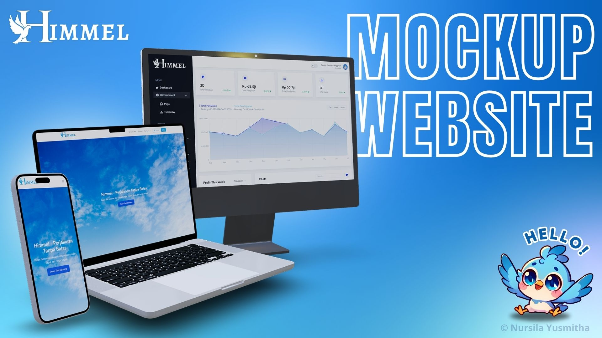

# 🌐 Frontend - Himmel Web Application

[](#)
[](./LICENSE)
[](https://vuejs.org/)
[](#)


This is the **full frontend source code** of a modern web application built using **Vue 3**, **Tailwind CSS**, and **Vite**.

It includes:
- A highly customized **Admin Panel** based on [TailAdmin v1.3](https://tailadmin.com)
- A **Customer Frontend** interface built 100% from scratch by Nursila Yusmitha Angghani

> ⚠️ This is a frontend-only repository. Backend is available in a separate private repository.

---

## 🎥 Full Live Demo

Experience a complete walkthrough of both the **Admin Panel** and **Customer Frontend** in action.  
Click below to watch the demo video on YouTube:

[](https://youtu.be/g7E3Ak7mhG0?si=W4jYVTSUtGwN7NQf)

👉 [Watch the Full Demo on YouTube](https://youtu.be/g7E3Ak7mhG0?si=W4jYVTSUtGwN7NQf)


---

## 📸 App Preview

Mockup and Live Preview from both Admin Panel and Customer Frontend:


<br />

<br />


---

## 🚀 Key Features

### 🛠️ Admin Panel
- 📊 Real-time dashboard with interactive charts and performance stats
- 👥 Full user management: create, update, delete users
- 🧩 Role-based access control (Developer, Admin, Staff, etc.)
- 🎟️ Manage technical modules, transport modules, routes, transactions, and vouchers
- 💬 Real-time chat system with customers
- 🎫 Voucher system with validation and usage history
- 📷 QR code ticketing system with scanner support
- 🔄 Ticket & complaint tracking system
- 🌙 Dark mode support
- 💻 Fully responsive for desktop, tablet, and mobile
- 🛠️ Built on TailAdmin v1.3 (MIT) with heavy codebase customization

---

### 👥 Customer Frontend
- 🔐 JWT-based authentication: register, login, logout
- 🧠 Forgot password via email
- 🧾 View & update user profile
- 🎫 Browse and claim voucher
- 📦 Place orders, cancel, and complete payments
- 🕓 View order history and complaint history
- 🎟️ Tickets with QR codes that can be scanned
- 🌙 Dark mode support
- 💻 Fully responsive design, built from scratch

---

## 🧪 Tech Stack

| Tool            | Usage                                   |
|-----------------|-----------------------------------------|
| **Vue 3**       | Composition API, reactive interface     |
| **Tailwind CSS**| Utility-first styling framework         |
| **Vite**        | Lightning-fast frontend tooling         |
| **Pinia**       | State management                        |
| **Axios**       | API communication (RESTful)             |
| **Chart.js**    | Visual dashboard charts                 |
| **SweetAlert2** | Stylish alerts and modals               |
...

---

## 📜 License

This frontend project is released under the MIT License for educational and portofolio purposes only. See [`LICENSE`](./LICENSE) for details.

---

## 📁 Folder Structure (Simplified)

```bash
frontend/
├── assets/           # Static images, icons, fonts
├── components/       # Vue components (UI blocks)
├── layouts/          # Admin & User layouts
├── pages/            # Route pages
├── router/           # Vue Router configuration
├── stores/           # Pinia store modules
├── views/            # Logical views (Admin, Customer)
├── public/           # Public assets (favicon, etc.)
├── App.vue
└── main.ts


